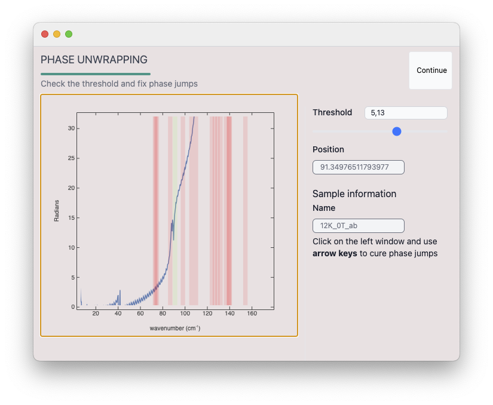

# TeraKitchen: A WLJS Application for Automated TDS-THz Spectroscopy Analysis
TeraKitchen is a WLJS Notebook application designed for automated analysis of optical time-domain transmission spectra. It features ~~AI-assisted~~ ML based reference/sample matching, Fabry–Pérot deconvolution, interactive phase unwrapping, and material parameter extraction—all integrated into a file-based workflow with automated reporting and metadata management.


*University of Augsburg, EPV*
*Developer: kirill.vasin@uni-a.de*


A WLJS Notebook app for managing and processing optical __time-domain transmission spectra__ based on __the open-source library__ [wl-tds-tools](https://github.com/JerryI/wl-tds-tools). 

## Tested on
- Topica TeraFlash (2016 - Now)
- TeraView Optical TDS Spectrometer (2009 - 2015)

and many many dielectric, semiconductor samples ranging from 50um up to 2mm in thickness.

## Key-features

- __works with normal files, stores everything in meta-data__
- __automatic reference-sample pairs matching__ using ELMo network
- automatic sorting using a local neural network
- __semiautomated advanced material parameters extraction__
- __Fabry-Pérot deconvolution (GPU accelerated if available)__
- __interactive phase unwrapping__
- __automated reports__
- easy exports to ASCII format

## How to run
1. Install [WLJS Notebook](https://wljs.io/)
2. Download this repository (clone or get `Source` from the releases page)
3. Start `TK.wlw`

## Screenshots

Preview on the selected project folder


Automatic reports


Assisted phase uwrapping


High-precision material parameters extraction


File names matcher


## Manual

### What and Why?

Extracting material parameters from optical data is a challenging task. In slab-like samples, the incoming pulse reflects within the material, resulting in the output spectrum being convolved with Fabry–Perot resonances. This is both a benefit and a challenge: while it complicates deconvolution, it also provides additional information about the sample thickness and helps compensate for aperture mismatches between the reference and the sample — a common issue in transmission experiments.

This tool was developed to automate much of this process for Time-Domain experiments.

**Key Features:**

- **File name decoding**: Automatically matches reference and sample pairs using an ElMO neural network.
- **Batch processing**: Computes transmission data for all selected files automatically.
- **Assisted phase unwrapping**: Optical phase is typically wrapped between -π and π, which is not usable for extracting optical parameters. This tool can automatically unwrap the phase and allows manual correction of excitonic positions (usually where phase breaks occur), if needed.
- **Accurate absorption coefficient extraction & Fabry–Perot deconvolution**: Offers an interactive process to iteratively correct thickness and gain, solving Fresnel equations and extracting refractive index \( n \), extinction coefficient \( k \), or complex \( \tilde{n} \).
- **Summary reporting**: Stacks and plots spectra (automatically sorted using a neural network) of optical conductivity, transmission, and absorption. Metadata is saved in the experiment folder.
- **File-based workflow**: Functions as a file browser. It recognizes processed spectra within a folder, displays previews, supports data modification, and works entirely offline by storing a `._TK_store` file in each experiment folder.

---

### Input Data Format

TeraKitchen works with ASCII-like files (CSV, TSV, DAT), stored separately for the sample and its corresponding reference in the time domain:

```
MySample_4K_0T.csv
MySample_4K_0T_ref.csv
...
```

Each file should contain two or more columns:

```
time axis; y-axis
```

You can select the appropriate units for the time axis in the import wizard window.

## Tutorials
In this guide, you will learn how to process and manage your spectral data. There are two general approaches to processing:

- **Folder-based processing**: everything, that *Quick anonymous processing* does, but the metadata is stored within the same folder as your files.
- **Quick anonymous processing**: This method uploads your files, processes them, displays a summary (from which you can export the necessary ASCII data), and then deletes the results.

Here we will focuses on the **first one**


### Process Raw Time-Traces

**Set the folder** containing your `CSV`, `TSV`, or `DAT` ASCII-like files measured for the **reference** and the **sample** (they must be in separate pairs).

#### Typical Folder Structure:

```
/my_sample
    sample_4K_2T.csv
    ref_4K_2T.csv
    sample_4K_3T.csv
    sample_4K_4T.csv
    ref_4K_5T.csv
    sample_4K_5T.csv
    sample_4K_6T.csv
    ...
```
> 💡 **Note:** The number of reference and sample spectra does **not** have to match. You may reuse the same reference for multiple sample spectra.

> ⚠️ **Important:** To help the program differentiate between references and samples, please **include** the word `ref` or `reference` in the **reference spectra filenames**.

---

#### 1. Summary Window

Here is the first window you will see:


> 💡 **Note:** If you have already processed the data before, you can access the final spectra from this window. See the **Revisit** section.

---

#### 2. Pairs Matching

In this step, the ELMo network will attempt to match each reference file to its corresponding sample using filename word analysis:


- You may zoom and pan as needed.
- **Columns** represent sample files.
- **Rows** represent available reference files.
- A **saturated warm color** indicates a **better match**. The program will select the best match (maximum value) for each column.

You can manually correct the matches by clicking the boxes — this toggles their state between maximum and minimum.

---

#### 3. Import Wizard

This window allows you to configure the file parser and provide minimum necessary information about your sample:


##### Overview:
- **FORMAT**: Usually `CSV`, even if the file extension is `.dat`.
- **TIME SCALE**: Choose the unit used for the **x-axis** in your time-traces (sample and reference).
- **BASELINE PADDING**: Adds zero-padding to the end of each time-trace to improve spectral resolution. The value is a multiplier — e.g., setting `2` doubles the resolution.

- **THICKNESS**: Approximate thickness of your sample in millimeters. Can be refined later using standing waves.
- **GAIN**: Compensates for differences in aperture sizes between sample and reference. A value of `1.5` amplifies the sample signal accordingly. This can also be refined later.
- **NOTES**: Any text information you want to associate with this batch.

> ✅ Make sure that **two numeric columns** appear in the preview before proceeding.


#### 4. Phase Cure

> **NOTE:** _Skip this step if you are not interested in high-accuracy material parameter extraction (including Fabry–Perot deconvolution) or if you have a poor signal-to-noise ratio._

This step attempts to fix phase jumps using a basic threshold filter, then allows you to manually adjust each breaking point.


Click on the left window to enter manual mode:

- **LEFT/RIGHT arrows**: Navigate between jump points.
- **UP/DOWN arrows**: Correct the phase jump by adding or subtracting \(2\pi\) from the rest of the curve. You may press multiple times, but the program limits the total phase correction to ±\(2\pi\), so you don’t need to worry about overcorrecting.

For example, at the very beginning, we see a shift of –6 radians:


Let’s fix it:


Now navigate to the next breaking point:



And fix it as well, keeping in mind how the phase of a Lorentz oscillator should look:


In any case, you can always go back and redo it. It will require some experience to guess the correct shape.

#### 5. Choose the Routine


Again: Choose `No` if you are not interested in high-accuracy material parameter extraction (including Fabry–Perot deconvolution) or if you have a poor signal-to-noise ratio.

---

#### 6. Choice: (Cancel) — Summary Table

It’s done 🎉


By selecting multiple files, you can generate a summary report. Or double-click on an individual file to view its summary.


You can easily spot features in the material parameters caused by reflections inside the sample. See how to get rid of them in **the next section**.

---

#### 6. Choice: (OK) — Material Parameters

If you choose to continue, the program will perform the deconvolution procedure. Note that this may not work for all samples — it requires a plane-parallel sample aligned precisely to the beam propagation.


Try adjusting both:
- **GAIN**
- **THICKNESS**

Usually, a unique combination of these two gives the best results.


> ⚠️ **Beware:** This step is extremely sensitive to minor changes in thickness.

---

#### 7. Choice: (OK) — Summary

Now your summary will look better, and the final report will include more detailed information.


---

### Revisit / View Already Processed Data

Press `Browse`:


Then select the folder containing the time-traces you previously processed:


From here, you can select and perform batch operations on processed or unprocessed data. For example, to generate a summary report, click `View`:


All data will be automatically sorted using the ELMo network and plotted in a stacked format. You can also export the data to ASCII.

### What can be exported?
- Absorption spectrum
- Refractive index (as a function frequency)
- Transmission spectrum (deconvoluted)
- Complex transmission spectrum (deconvoluted)
- Complex refractive index (as a function frequency)

## Example Data
### ATR470
The easiest example. Open `Example Data/ATR470` and try to process with the following initial parameters:

- THICKNESS: `0.5` mm
- GAIN: `1`

Phase cure in principle has been already covered on the screenshots above.

### ATR384
This is a litte more difficult, since this is a very thin sample. Try:

- THICKNESS: `0.1` mm
- GAIN: `0.75`

It does not need a phase cure.


## Acknowledgments 💛
The work of K.V. (@JerryI) was supported by the Deutsche Forschungsgemeinschaft (DFG, German Research Foundation)-TRR 360-492547816

I am deeply grateful to Dr. Joachim Deisenhofer for countless discussions, endless support, and deep insights into THz spectroscopy.

## License
__MIT__

*excluding ELMo Contextual Word Representations Trained on 1B Word Benchmark component  